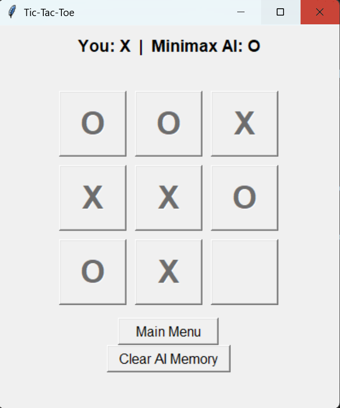
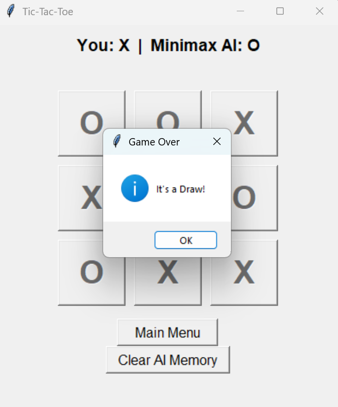
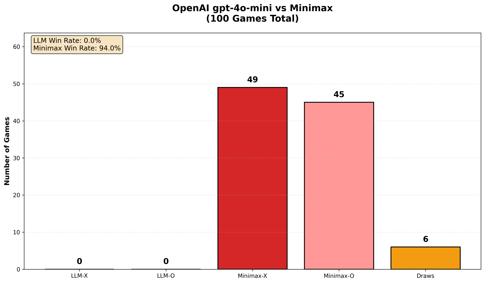
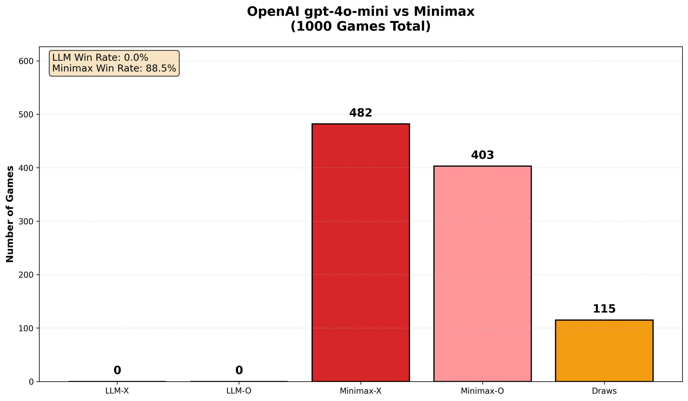
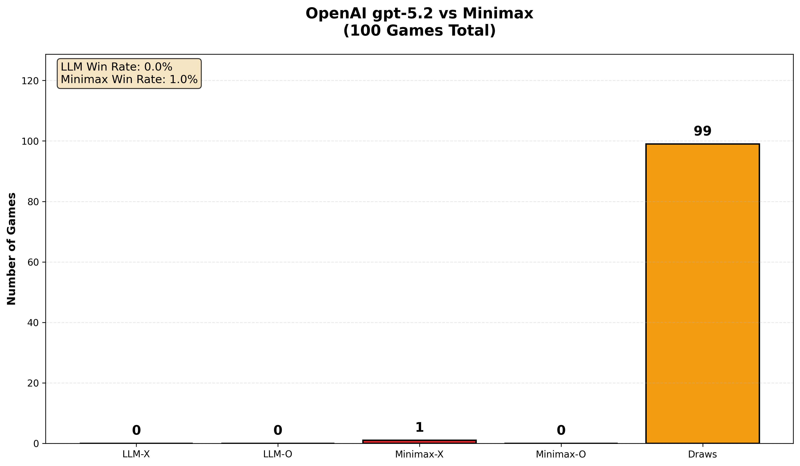
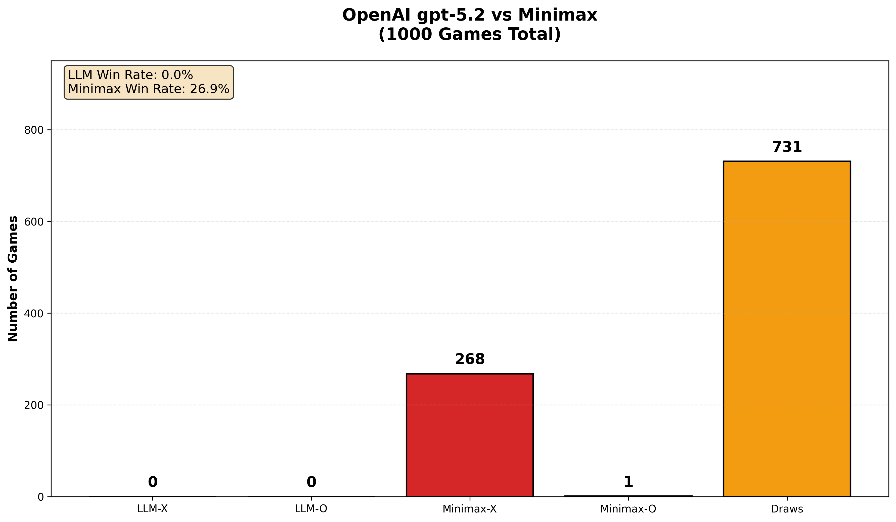

# Unbeatable Tic-Tac-Toe Project

**Comprehensive Python Tic-Tac-Toe with unbeatable Minimax AI, Tkinter GUI, reinforcement learning, and optional OpenAI LLM benchmarking.** Core gameplay uses pure Python 3.10+ standard library; OpenAI is only required if you enable LLM mode/benchmarks. 

## Project Overview
This project delivers a complete Tic-Tac-Toe system where players choose X (first) or O (second) against an optimal Minimax AI that guarantees at least a draw with perfect play, plus an optional LLM opponent for comparison experiments. The OpenAI integration reads the API key from `OPENAI_API_KEY` in your environment (recommended) and can optionally be loaded from a `.env` file during local development. 

## Core Components

### `src/game.py` - Game Engine & AI
- 3x3 board state management, move validation, win/draw detection via 8 winning combinations.
- **Minimax algorithm**: Full-depth search with tie-breaking heuristics (center > corners > edges).
- **Reinforcement learning**: `tictactoememory.json` tracks state-action stats (wins/losses/draws), preferring proven moves among equally optimal Minimax choices.
- `get_best_move()` balances Minimax score, learned stats, and positional heuristics.

### `src/gui.py` - Tkinter Interface
- Symbol selection screen (X/O).
- AI mode selection:
  - **Minimax** (default, unbeatable).
  - **LLM (OpenAI)** (optional).
- Interactive 3x3 clickable grid with disabled post-move buttons.
- Auto AI responses (visual delay), status display, and end-game modals.
- Reset to main menu and “Clear AI Memory”.

## LLM Mode (OpenAI)

### What you need
- An OpenAI API key available as the environment variable `OPENAI_API_KEY`. 
- Keep secrets out of source control (add `.env` to `.gitignore`). 

### 1) Create a `.env` file (recommended for local dev)
Create `.env` in the project root:

OPENAI_API_KEY=sk-your_key_here

text

> Do not commit `.env` to git. 

### 2) Load the key into your environment

#### Option A: Export it in your shell (no code changes)
**macOS / Linux**

export OPENAI_API_KEY="sk-your_key_here"
python -m src.gui

text

**Windows (PowerShell)**

setx OPENAI_API_KEY "sk-your_key_here"
python -m src.gui

text

OpenAI tools/clients commonly read `OPENAI_API_KEY` from the environment. 

#### Option B: Auto-load `.env` in pure stdlib (no extra dependencies)
If this repo avoids third-party packages, add a tiny `.env` loader (simple `KEY=VALUE` parsing) and call it early at startup so `os.environ["OPENAI_API_KEY"]` is set before any OpenAI calls. Parsing `.env`-style files into environment variables is a common approach. 

> Note: The official OpenAI Python README often suggests `python-dotenv`, but this project can stay dependency-free by using a small stdlib loader instead. 

### 3) Use the LLM in the GUI
1. Run the GUI.
2. Select **LLM AI (OpenAI)**.
3. Pick a model (e.g., `gpt-4.1-mini` or `gpt-5.2`).
4. Start the game.

## Benchmarking Suite

### `src/test_runner.py` - AI-vs-AI Verification
- Multiprocessing Pool across CPU cores for 5k–10k+ games.
- Alternates X/O starters, tracks win/draw rates (expected: all draws with perfect play).

### `src/OpenAivsMiniMax.py` & `src/OpenAi.py` - LLM Comparison
- Prompts an OpenAI model with a board representation and requests a single integer move (0–8).
- Runs matchups vs Minimax; invalid moves can fall back to a random valid move.
- Reports LLM win/draw/loss rates vs solved Minimax.

## Screenshots

### Start menu

### Gameplay

### Example draw

## Benchmark results

### GPT‑4o‑mini vs Minimax (100 games)

### GPT‑4o‑mini vs Minimax (1000 games)

### GPT‑5.2 vs Minimax (100 games)

### GPT‑5.2 vs Minimax (1000 games)

## Security Notes
- Never hardcode API keys in source files. 
- Add `.env` to `.gitignore` and rotate keys if they’re ever exposed. 

## Future Enhancements
- Difficulty levels (random, depth-limited minimax).
- Move history/undo.
- Pygame version.
- Web deployment (Streamlit/Flask).
- Alpha-beta pruning for larger boards.

## License
MIT